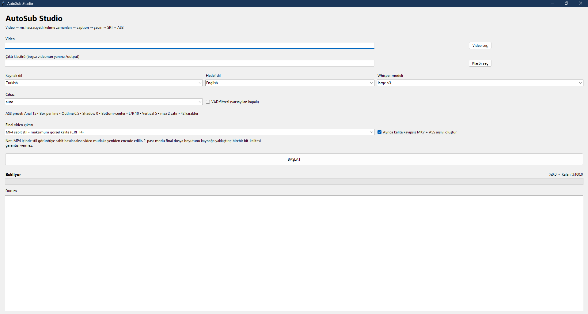

# AutoSub Studio

**AutoSub Studio** is a local Windows application for automatic speech transcription, subtitle translation, subtitle formatting, and final video generation.

The application processes video files locally, generates synchronized **SRT** and styled **ASS** subtitle files, and can render subtitles directly into a final **H.264 / AVC MP4** video.

---

## Features

- Automatic speech recognition with Faster-Whisper
- Whisper Large-v3 support
- Word-level timestamps
- Millisecond subtitle timing
- Automatic caption segmentation
- NLLB-based subtitle translation
- SRT subtitle generation
- Styled ASS subtitle generation
- Automatic two-line subtitle formatting
- Configurable Voice Activity Detection (VAD)
- CPU processing support
- NVIDIA CUDA acceleration
- Real-time processing progress
- FFmpeg and FFprobe integration
- H.264 / AVC MP4 output
- High-quality CRF 14 rendering
- Two-pass source-size-oriented encoding
- Lossless MKV + ASS mode
- MP4 soft subtitle mode
- Audio stream copy without re-encoding

---

## Processing Pipeline

<pre>
Video
  |
  v
Faster-Whisper Large-v3
  |
  v
Word-Level Timestamps
  |
  v
Caption Segmentation
  |
  v
Translation
  |
  v
SRT + ASS Generation
  |
  v
FFmpeg
  |
  v
Final H.264 MP4 / MKV
</pre>

---

## Default Subtitle Style

| Setting | Value |
|---|---|
| Font | Arial |
| Font size | 15 |
| Text color | White |
| Border style | Box per line |
| Outline | 0.5 |
| Shadow | 0 |
| Alignment | Bottom-center |
| Left margin | 10 |
| Right margin | 10 |
| Vertical margin | 5 |
| Maximum lines | 2 |
| Target characters per line | ~42 |

The ASS subtitle format preserves the visual subtitle configuration.

---

## Installation

### Requirements

- Windows 10 or Windows 11
- Internet connection for initial installation and model downloads
- NVIDIA GPU recommended for faster transcription
- CPU processing is also supported

### Download

The easiest installation method is downloading:

**AutoSub-Studio-Windows.zip**

from the GitHub Releases section.

Latest release:

https://github.com/bartusari68/AutoSub-Studio/releases/latest

Alternatively, clone the repository:

    git clone https://github.com/bartusari68/AutoSub-Studio.git

---

## Quick Setup

After downloading or cloning AutoSub Studio, run:

    SETUP.bat

This creates the local Python virtual environment and installs the required core and translation dependencies.

For NVIDIA GPU acceleration, additionally run:

    CUDA_SETUP.bat

Optional system checks:

    CHECK_CUDA.bat
    CHECK_FFMPEG.bat

Start AutoSub Studio with:

    START.bat

or:

    AutoSubStudio.vbs

AutoSubStudio.vbs starts the graphical interface without displaying the command-line window.

---

## First Launch

AutoSub Studio creates its own Python virtual environment:

    .venv/

The virtual environment is generated locally and is intentionally excluded from the GitHub repository.

Required AI models are downloaded automatically when they are first needed.

After the initial download, cached models are reused in later sessions.

---

## Application Workflow

1. Select a video file.
2. Select the source language.
3. Select the target language.
4. Select the Whisper model.
5. Select CPU, CUDA, or automatic device detection.
6. Enable or disable VAD.
7. Select the final video output mode.
8. Start processing.

AutoSub Studio then performs transcription, caption generation, translation, subtitle generation, and optional video rendering automatically.

---

## Output Files

A typical processing session generates:

<pre>
output/
|
|-- video.tr.source.srt
|-- video.en.srt
|-- video.en.ass
|-- video.words.json
|-- video.timeline.json
-- video.SUBBED_HQ.mp4
</pre>

### Source SRT

Contains the transcription in the source language.

### Translated SRT

Contains translated subtitle text with timestamps.

### ASS

Contains subtitle timing and visual styling.

### words.json

Stores word-level recognition results including individual start and end timestamps.

### timeline.json

Stores caption-level timing together with source text and translated text.

---

## Final Video Modes

### H.264 MP4 - Source-Size Oriented

This mode uses two-pass H.264 encoding and attempts to produce a final file size close to the source video.

Settings:

| Setting | Value |
|---|---|
| Container | MP4 |
| Codec | H.264 / AVC |
| Encoder | libx264 |
| Pixel format | yuv420p |
| Preset | slow |
| Audio | copy |
| Encoding | 2-pass |

The ASS subtitle is permanently burned into the video.

Because the subtitle becomes part of the image, video re-encoding is required.

---

### H.264 MP4 - Maximum Visual Quality

This mode prioritizes visual quality instead of output file size.

Settings:

| Setting | Value |
|---|---|
| Container | MP4 |
| Codec | H.264 / AVC |
| Encoder | libx264 |
| CRF | 14 |
| Preset | slow |
| Pixel format | yuv420p |
| Audio | copy |

The final file size may be larger or smaller than the source video depending on the original material.

---

### MKV + ASS - No Video Re-encoding

This mode preserves the original video and audio streams.

Settings:

| Stream | Mode |
|---|---|
| Video | copy |
| Audio | copy |
| Subtitle | ASS |
| Container | MKV |

The video bitstream remains unchanged.

ASS subtitles are stored as a separate subtitle track and retain their styling on compatible players.

---

### MP4 Soft Subtitle - No Video Re-encoding

Settings:

| Stream | Mode |
|---|---|
| Video | copy |
| Audio | copy |
| Subtitle | mov_text |
| Container | MP4 |

Video quality is unchanged because the video stream is copied.

Advanced ASS styling is not guaranteed in this mode.

---

## H.264 Output Standard

All fixed-style burned-in MP4 outputs use:

- H.264 / AVC
- libx264
- yuv420p
- MP4 container
- audio stream copy

The input codec does not determine the final codec.

H.264, H.265 / HEVC, AV1, VP9, MPEG-4, and other supported input formats are converted to H.264 for fixed-style final MP4 output.

---

## Real-Time Progress Tracking

AutoSub Studio displays processing progress during the complete workflow.

Progress is calculated using actual processing information such as:

- processed video timestamp during transcription
- completed subtitle caption count during translation
- FFmpeg output timestamp during rendering
- individual stages during two-pass encoding

This allows the user to monitor the transcription, translation, subtitle generation, and rendering process in real time.

---

## Voice Activity Detection

Voice Activity Detection (VAD) is disabled by default.

This reduces the risk of quiet, distant, or low-volume speech being incorrectly discarded.

VAD can be enabled for recordings containing long silent sections or significant background noise.

---

## Technology Stack

AutoSub Studio uses:

- Python
- Tkinter
- Faster-Whisper
- Whisper Large-v3
- CTranslate2
- PyTorch
- Hugging Face Transformers
- NLLB
- FFmpeg
- FFprobe

---

## Privacy

Video processing is performed locally on the user's computer.

After the required models have been downloaded, videos do not need to be uploaded to an external transcription service.

This allows transcription, subtitle generation, translation, and rendering to remain within the local processing environment.

---

## Third-Party Models

AutoSub Studio can automatically download and use third-party AI models.

Third-party models are distributed under their own licenses and are not covered by the AutoSub Studio software license.

Users should review the applicable license terms before using individual models.

---

## Project Structure

<pre>
AutoSub-Studio/
|
|-- app.py
|-- AutoSubStudio.vbs
|-- START.bat
|-- SETUP.bat
|
|-- INSTALL_CORE.bat
|-- INSTALL_TRANSLATION.bat
|-- CUDA_SETUP.bat
|
|-- CHECK_CUDA.bat
|-- CHECK_FFMPEG.bat
|
|-- requirements-core.txt
|-- requirements-translation.txt
|
|-- assets/
|   -- autosub-studio.png
|
|-- README.md
|-- LICENSE
-- .gitignore
</pre>

The .venv directory is generated during installation and is not stored in the repository.

---

## Planned Improvements

Planned development areas include:

- Context-aware semantic subtitle translation
- Local LLM translation mode
- Improved sentence-aware caption segmentation
- Automatic subtitle quality control
- Proper-name protection
- Translation repetition detection
- Forced alignment
- Improved TR <-> EN translation quality
- Standalone Windows executable

---

## Releases

Stable Windows packages are distributed through GitHub Releases.

Current release:

**v1.0.0 - Initial Public Release**

Package:

**AutoSub-Studio-Windows.zip**

---

## Author

**Bartu Sarı**

Software Engineering  
Atılım University

---

## License

See the LICENSE file for software licensing information.
